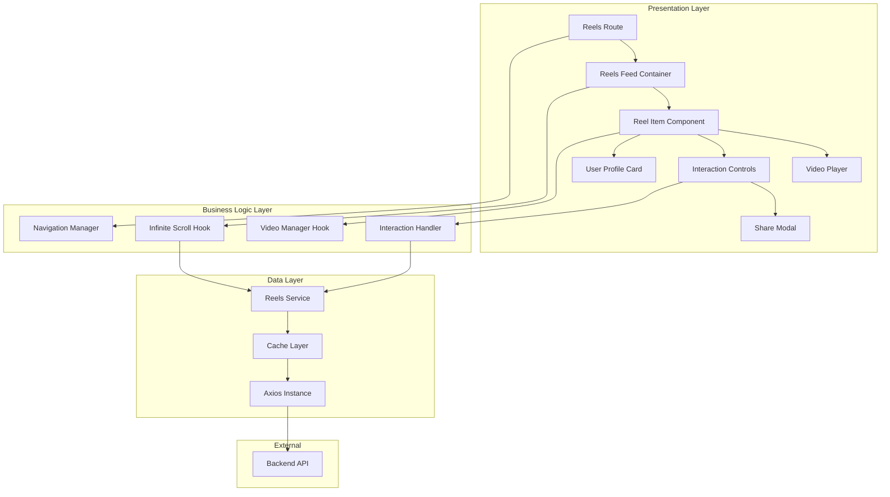

# Design Document: Reels Feature Improvement

## Overview

This design document outlines the technical architecture for transforming the existing basic reels implementation into a premium, production-grade social media experience. The enhancement focuses on delivering smooth video playback, intuitive interactions, seamless infinite scrolling, and comprehensive accessibility while maintaining integration with the existing React Router application.

### Current State

The existing implementation (`app/routes/reels.tsx`) provides basic functionality:
- Swiper-based vertical scrolling with virtual slides
- Basic video playback with play/pause toggle
- Simple share functionality (copy to clipboard)
- URL-based deep linking with `reelId` parameter
- Cursor-based pagination with the API

### Design Goals

1. **Premium User Experience**: Deliver smooth, responsive interactions matching modern social media standards
2. **Performance**: Achieve sub-1.5s First Contentful Paint and 60fps scrolling through virtual scrolling and intelligent preloading
3. **Accessibility**: Full WCAG AA compliance with keyboard navigation and screen reader support
4. **Maintainability**: Modular architecture with clear separation of concerns
5. **Scalability**: Support for future features like comments, advanced analytics, and content discovery

### Technology Stack

- **Framework**: React 19 with React Router v7
- **Video Management**: Native HTML5 video with Intersection Observer API
- **Virtual Scrolling**: Custom implementation using `react-window` or `@tanstack/react-virtual`
- **State Management**: React hooks with context for global state (user preferences, authentication)
- **API Client**: Existing axios instance with interceptors
- **Animations**: CSS transitions with `framer-motion` for complex interactions
- **Testing**: Vitest for unit tests, `fast-check` for property-based testing

## Architecture

### High-Level Architecture



### Component Hierarchy

```
ReelsRoute (Route Handler)
└── ReelsFeedContainer (Virtual Scroll Manager)
    ├── VirtualScrollWindow (Virtual Scroll Implementation)
    │   └── ReelItem (Individual Reel)
    │       ├── VideoPlayer (Video Playback)
    │       │   ├── VideoElement (Native HTML5 Video)
    │       │   ├── PlayPauseOverlay
    │       │   ├── ProgressIndicator
    │       │   └── VolumeControl
    │       ├── InteractionControls (Action Buttons)
    │       │   ├── LikeButton
    │       │   ├── CommentButton
    │       │   ├── ShareButton
    │       │   └── FollowButton
    │       ├── UserProfileCard (Creator Info)
    │       │   ├── Avatar
    │       │   ├── Username
    │       │   └── FollowButton
    │       └── ReelMetadata (Caption, Tags, Music)
    ├── LoadingIndicator
    └── EndOfFeedMessage
```

### Data Flow

1. **Initial Load**:
   - Route loader fetches first page of reels
   - If `reelId` query param exists, fetch specific reel and prepend to feed
   - ReelsFeedContainer initializes virtual scroll with data
   - First reel auto-plays when in viewport

2. **Infinite Scroll**:
   - Scroll position monitored by InfiniteScroll hook
   - When user reaches threshold (3 reels from end), fetch next page
   - Use `nextCursor` from previous response for pagination
   - Append new reels to virtual scroll list
   - Continue until `hasMore` is false

3. **Video Playback**:
   - Intersection Observer tracks which reel is in viewport
   - Active reel auto-plays, others pause
   - Preload next 2 videos in queue
   - Release video resources for reels >3 positions away

4. **User Interactions**:
   - Like/Unlike: Optimistic UI update → API call → Revert on error
   - Share: Generate URL → Copy to clipboard or native share
   - Follow: API call → Update UI state
   - Comment: Open modal overlay (future implementation)

5. **Navigation**:
   - Active reel updates URL with `reelId` parameter
   - Browser history tracks reel transitions
   - Back/forward navigation changes active reel
   - Page refresh restores reel from URL

## Components and Interfaces

### Core Components

#### 1. ReelsRoute Component

**Purpose**: Route handler that manages initial data loading and provides layout structure.

**Props**: None (uses React Router hooks)

**Key Responsibilities**:
- Load initial reels data via loader function
- Handle deep linking with `reelId` parameter
- Manage page metadata (title, description, Open Graph tags)
- Provide error boundary for route-level errors
- Disable default layout (full-screen experience)

**Interface**:
```typescript
export async function loader({ request }: LoaderFunctionArgs): Promise<ReelsLoaderData> {
  const url = new URL(request.url);
  const cursor = url.searchParams.get("cursor") || undefined;
  const reelId = url.searchParams.get("reelId") || undefined;
  
  // Fetch initial reels
  const data = await reelsService.getReels(cursor);
  
  // Handle deep linking
  if (reelId) {
    const specificReel = await reelsService.getReelById(reelId);
    // Prepend specific reel and remove duplicates
  }
  
  return data;
}

export function meta({ data }: { data: ReelsLoaderData }) {
  // Generate meta tags for SEO and social sharing
}

export const handle = {
  disableLayout: true, // Full-screen experience
};
```

#### 2. ReelsFeedContainer Component

**Purpose**: Manages virtual scrolling, infinite pagination, and reel lifecycle.

**Props**:
```typescript
interface ReelsFeedContainerProps {
  initialReels: Reel[];
  initialCursor?: string;
  initialHasMore: boolean;
}
```

**State**:
```typescript
interface ReelsFeedState {
  reels: Reel[];
  activeIndex: number;
  nextCursor?: string;
  hasMore: boolean;
  isLoadingMore: boolean;
  error: string | null;
}
```

**Key Responsibilities**:
- Implement virtual scrolling with `@tanstack/react-virtual`
- Monitor scroll position and trigger infinite scroll
- Track active reel index
- Update URL when active reel changes
- Manage video preloading queue
- Handle loading and error states

**Hooks Used**:
- `useInfiniteScroll`: Manages pagination logic
- `useActiveReelTracker`: Tracks which reel is in viewport
- `useNavigationSync`: Syncs active reel with URL

#### 3. ReelItem Component

**Purpose**: Renders individual reel with video, interactions, and metadata.

**Props**:
```typescript
interface ReelItemProps {
  reel: Reel;
  isActive: boolean;
  isPreloading: boolean;
  onLike: (reelId: string) => Promise<void>;
  onUnlike: (reelId: string) => Promise<void>;
  onShare: (reelId: string) => void;
  onFollow: (userId: string) => Promise<void>;
  onComment: (reelId: string) => void;
  onViewCountIncrement: (reelId: string) => void;
}
```

**Key Responsibilities**:
- Render video player with controls
- Display user profile card
- Render interaction controls
- Show reel metadata (caption, tags, music)
- Handle tap-to-play/pause
- Handle double-tap-to-like
- Track view duration for analytics

#### 4. VideoPlayer Component

**Purpose**: Manages video playback with auto-play, preloading, and controls.

**Props**:
```typescript
interface ReelVideoPlayerProps {
  src: string;
  poster?: string;
  isActive: boolean;
  shouldPreload: boolean;
  onPlay?: () => void;
  onPause?: () => void;
  onEnded?: () => void;
  onError?: (error: MediaError) => void;
  onProgress?: (progress: number) => void;
  muted?: boolean;
  loop?: boolean;
}
```

**State**:
```typescript
interface VideoPlayerState {
  isPlaying: boolean;
  currentTime: number;
  duration: number;
  buffered: number;
  volume: number;
  isMuted: boolean;
  isBuffering: boolean;
  error: MediaError | null;
  playbackSpeed: number;
}
```

**Key Responsibilities**:
- Auto-play when `isActive` becomes true
- Pause when `isActive` becomes false
- Preload video when `shouldPreload` is true
- Display progress indicator
- Handle play/pause toggle on tap
- Handle volume control
- Handle playback speed options (long-press)
- Display error overlay with retry
- Loop seamlessly on end

**Hooks Used**:
- `useVideoPlayback`: Manages playback state and controls
- `useVideoPreloader`: Handles preloading logic
- `useGestureHandlers`: Handles tap, double-tap, long-press

#### 5. InteractionControls Component

**Purpose**: Renders action buttons (like, comment, share, follow) with animations.

**Props**:
```typescript
interface InteractionControlsProps {
  reel: Reel;
  isLiked: boolean;
  isFollowing: boolean;
  onLike: () => Promise<void>;
  onUnlike: () => Promise<void>;
  onComment: () => void;
  onShare: () => void;
  onFollow: () => Promise<void>;
  isAuthenticated: boolean;
}
```

**Key Responsibilities**:
- Render like button with count and animation
- Render comment button with count
- Render share button with count
- Render follow button (if not own reel)
- Handle optimistic UI updates
- Revert on error with toast notification
- Prompt login for unauthenticated users
- Animate state changes

#### 6. UserProfileCard Component

**Purpose**: Displays creator information with follow functionality.

**Props**:
```typescript
interface UserProfileCardProps {
  user: {
    id: string;
    username: string;
    avatarUrl: string | null;
    isVerified: boolean;
    followerCount?: number;
    bio?: string;
  };
  isFollowing: boolean;
  isOwnReel: boolean;
  onFollow: () => Promise<void>;
  onProfileClick: () => void;
}
```

**Key Responsibilities**:
- Display avatar with fallback
- Display username with verification badge
- Display follower count (formatted)
- Display bio if available
- Render follow button (if not own reel)
- Handle profile navigation
- Support quick actions menu (future)

#### 7. ShareModal Component

**Purpose**: Provides multiple sharing options with platform-specific handlers.

**Props**:
```typescript
interface ShareModalProps {
  reel: Reel;
  isOpen: boolean;
  onClose: () => void;
}
```

**Key Responsibilities**:
- Generate shareable URL with `reelId`
- Copy URL to clipboard
- Use Web Share API when available
- Provide platform-specific share buttons (WhatsApp, Twitter, Facebook, Telegram)
- Display success toast on copy
- Include reel metadata in shared content
- Support video download (future)

### Custom Hooks

#### useInfiniteScroll

**Purpose**: Manages infinite scroll pagination logic.

**Interface**:
```typescript
function useInfiniteScroll(options: {
  hasMore: boolean;
  isLoading: boolean;
  threshold: number; // Number of items from end to trigger load
  onLoadMore: () => void;
}): {
  scrollRef: RefObject<HTMLElement>;
  isNearEnd: boolean;
}
```

**Implementation**:
- Monitor scroll position with `IntersectionObserver` or scroll events
- Debounce scroll events (100ms)
- Trigger `onLoadMore` when within threshold
- Prevent multiple simultaneous loads

#### useVideoPlayback

**Purpose**: Manages video playback state and controls.

**Interface**:
```typescript
function useVideoPlayback(
  videoRef: RefObject<HTMLVideoElement>,
  isActive: boolean
): {
  state: VideoPlayerState;
  controls: {
    play: () => Promise<void>;
    pause: () => void;
    togglePlayPause: () => void;
    seek: (time: number) => void;
    setVolume: (volume: number) => void;
    toggleMute: () => void;
    setPlaybackSpeed: (speed: number) => void;
  };
}
```

**Implementation**:
- Listen to video events (play, pause, timeupdate, ended, error)
- Auto-play when `isActive` becomes true (with 300ms delay)
- Auto-pause when `isActive` becomes false
- Handle playback errors with retry logic
- Persist volume preference to localStorage

#### useActiveReelTracker

**Purpose**: Tracks which reel is currently in viewport.

**Interface**:
```typescript
function useActiveReelTracker(
  reels: Reel[],
  containerRef: RefObject<HTMLElement>
): {
  activeIndex: number;
  activeReel: Reel | null;
}
```

**Implementation**:
- Use `IntersectionObserver` to track reel visibility
- Determine active reel based on highest intersection ratio
- Debounce updates to prevent rapid changes
- Support both vertical and horizontal scrolling

#### useNavigationSync

**Purpose**: Syncs active reel with URL and browser history.

**Interface**:
```typescript
function useNavigationSync(
  activeReel: Reel | null,
  reels: Reel[]
): void
```

**Implementation**:
- Update URL with `reelId` parameter when active reel changes
- Use `history.replaceState` to avoid polluting history
- Update page title with reel caption
- Update meta tags for social sharing
- Listen to popstate events for back/forward navigation
- Restore active reel from URL on mount

#### useGestureHandlers

**Purpose**: Handles touch and mouse gestures for video interactions.

**Interface**:
```typescript
function useGestureHandlers(options: {
  onTap: () => void;
  onDoubleTap: () => void;
  onLongPress: () => void;
}): {
  handlers: {
    onPointerDown: (e: PointerEvent) => void;
    onPointerUp: (e: PointerEvent) => void;
    onPointerMove: (e: PointerEvent) => void;
  };
}
```

**Implementation**:
- Track pointer down/up events
- Detect single tap (toggle play/pause)
- Detect double tap (like action with animation)
- Detect long press (show playback speed menu)
- Prevent default behavior for double-tap zoom

### Service Layer

#### ReelsService (Enhanced)

**Current Implementation**: Basic CRUD operations for reels.

**Enhancements Needed**:

```typescript
class ReelsService {
  // Existing methods
  async getReels(cursor?: string, limit?: number): Promise<ReelsResponse>;
  async getReelById(id: string): Promise<Reel>;
  async likeReel(id: string): Promise<void>;
  async unlikeReel(id: string): Promise<void>;
  
  // New methods
  async followUser(userId: string): Promise<void>;
  async unfollowUser(userId: string): Promise<void>;
  async incrementViewCount(reelId: string): Promise<void>;
  async incrementShareCount(reelId: string): Promise<void>;
  async getReelsByTag(tag: string, cursor?: string): Promise<ReelsResponse>;
  async getRelatedReels(reelId: string, limit?: number): Promise<Reel[]>;
}
```

**Caching Strategy**:
- Cache reel list responses for 5 minutes
- Invalidate cache on like/unlike actions
- Use ETags for conditional requests
- Implement stale-while-revalidate pattern

## Data Models

### Reel Interface (Enhanced)

```typescript
interface Reel {
  // Existing fields
  id: string;
  videoUrl: string;
  thumbnailUrl: string | null;
  caption: string;
  duration: string;
  viewsCount: number;
  likesCount: number;
  commentsCount: number;
  sharesCount: number;
  isPublished: boolean;
  createdAt: string;
  userId: string;
  userName: string | null;
  userAvatarUrl: string | null;
  tags: string[];
  isLikedByCurrentUser: boolean | null;
  
  // New fields (optional, for future enhancements)
  isFollowingUser?: boolean;
  userIsVerified?: boolean;
  userFollowerCount?: number;
  userBio?: string;
  musicInfo?: {
    title: string;
    artist: string;
    url?: string;
  };
  relatedReels?: string[]; // Array of reel IDs
}
```

### ReelsResponse Interface

```typescript
interface ReelsResponse {
  reels: Reel[];
  nextCursor?: string;
  hasMore: boolean;
  totalCount?: number; // Optional, for analytics
}
```

### VideoPlayerState Interface

```typescript
interface VideoPlayerState {
  isPlaying: boolean;
  currentTime: number;
  duration: number;
  buffered: number; // Percentage buffered (0-100)
  volume: number; // 0-1
  isMuted: boolean;
  playbackSpeed: number; // 0.5, 1, 1.5, 2
  isBuffering: boolean;
  error: MediaError | null;
  hasStarted: boolean; // Track if video has played at least once
}
```

### InteractionState Interface

```typescript
interface InteractionState {
  isLiked: boolean;
  isFollowing: boolean;
  likesCount: number;
  commentsCount: number;
  sharesCount: number;
  viewsCount: number;
  isProcessing: boolean; // Prevent double-clicks
}
```

### UserPreferences Interface

```typescript
interface UserPreferences {
  defaultMuted: boolean;
  defaultPlaybackSpeed: number;
  autoPlayEnabled: boolean;
  reducedMotion: boolean;
  dataUsageMode: 'low' | 'medium' | 'high'; // Video quality preference
}
```

### Error Types

```typescript
interface ReelError {
  type: 'network' | 'video' | 'auth' | 'validation' | 'unknown';
  message: string;
  code?: string;
  reelId?: string;
  retryable: boolean;
}

interface ValidationError {
  field: string;
  message: string;
}

interface APIError {
  status: number;
  message: string;
  errors?: ValidationError[];
}
```

## 

## Virtual Scrolling Implementation

### Why Virtual Scrolling?

Virtual scrolling is essential for performance when dealing with potentially infinite lists. Instead of rendering all reels in the DOM, we only render the visible items plus a small buffer. This approach:

- Limits DOM nodes to ~10 items regardless of total reels loaded
- Maintains 60fps scroll performance
- Reduces memory consumption
- Enables smooth infinite scrolling

### Implementation with @tanstack/react-virtual

**Library Choice**: `@tanstack/react-virtual` is chosen for its:
- Framework-agnostic core with React bindings
- Support for variable item sizes
- Built-in scroll restoration
- Active maintenance and TypeScript support

**Basic Structure**:

```typescript
import { useVirtualizer } from '@tanstack/react-virtual';

function ReelsFeedContainer({ initialReels }: Props) {
  const parentRef = useRef<HTMLDivElement>(null);
  const [reels, setReels] = useState(initialReels);
  
  const virtualizer = useVirtualizer({
    count: reels.length,
    getScrollElement: () => parentRef.current,
    estimateSize: () => window.innerHeight, // Each reel is viewport height
    overscan: 2, // Render 2 items above and below viewport
  });
  
  return (
    <div ref={parentRef} style={{ height: '100vh', overflow: 'auto' }}>
      <div
        style={{
          height: `${virtualizer.getTotalSize()}px`,
          position: 'relative',
        }}
      >
        {virtualizer.getVirtualItems().map((virtualItem) => (
          <div
            key={virtualItem.key}
            style={{
              position: 'absolute',
              top: 0,
              left: 0,
              width: '100%',
              height: `${virtualItem.size}px`,
              transform: `translateY(${virtualItem.start}px)`,
            }}
          >
            <ReelItem
              reel={reels[virtualItem.index]}
              isActive={activeIndex === virtualItem.index}
            />
          </div>
        ))}
      </div>
    </div>
  );
}
```

### Scroll Restoration

When users navigate away and return, restore their position:

```typescript
// Save scroll position before unmount
useEffect(() => {
  return () => {
    sessionStorage.setItem('reels-scroll-position', String(activeIndex));
  };
}, [activeIndex]);

// Restore on mount
useEffect(() => {
  const savedPosition = sessionStorage.getItem('reels-scroll-position');
  if (savedPosition) {
    const index = parseInt(savedPosition, 10);
    virtualizer.scrollToIndex(index, { align: 'start' });
  }
}, []);
```

## Video Preloading Strategy

### Preloading Queue

To ensure smooth transitions, we preload videos intelligently:

1. **Active Video**: Currently playing (priority 1)
2. **Next Video**: Preload immediately (priority 2)
3. **Next + 1 Video**: Preload when next video is buffered (priority 3)
4. **Previous Video**: Keep in memory if recently viewed (priority 4)

### Implementation

```typescript
function useVideoPreloader(
  reels: Reel[],
  activeIndex: number,
  maxConcurrent: number = 2
) {
  const preloadedVideos = useRef<Set<string>>(new Set());
  
  useEffect(() => {
    const toPreload = [
      reels[activeIndex + 1], // Next
      reels[activeIndex + 2], // Next + 1
    ].filter(Boolean);
    
    // Limit concurrent preloads
    const preloadQueue = toPreload.slice(0, maxConcurrent);
    
    preloadQueue.forEach((reel) => {
      if (!preloadedVideos.current.has(reel.id)) {
        const video = document.createElement('video');
        video.src = reel.videoUrl;
        video.preload = 'auto';
        video.load();
        preloadedVideos.current.add(reel.id);
      }
    });
    
    // Cleanup: Release videos far from active index
    const toRelease = Array.from(preloadedVideos.current).filter((id) => {
      const index = reels.findIndex((r) => r.id === id);
      return Math.abs(index - activeIndex) > 3;
    });
    
    toRelease.forEach((id) => {
      preloadedVideos.current.delete(id);
      // Browser will garbage collect the video element
    });
  }, [activeIndex, reels]);
}
```

### Adaptive Quality

For users on slow connections, automatically reduce video quality:

```typescript
function useAdaptiveQuality() {
  const [quality, setQuality] = useState<'high' | 'medium' | 'low'>('high');
  
  useEffect(() => {
    if ('connection' in navigator) {
      const connection = (navigator as any).connection;
      
      const updateQuality = () => {
        const effectiveType = connection.effectiveType;
        
        if (effectiveType === '4g') {
          setQuality('high');
        } else if (effectiveType === '3g') {
          setQuality('medium');
        } else {
          setQuality('low');
        }
      };
      
      updateQuality();
      connection.addEventListener('change', updateQuality);
      
      return () => connection.removeEventListener('change', updateQuality);
    }
  }, []);
  
  return quality;
}
```

## Interaction Handling

### Optimistic UI Updates

For better perceived performance, update UI immediately before API calls:

```typescript
async function handleLike(reelId: string) {
  // Optimistic update
  setReels((prev) =>
    prev.map((reel) =>
      reel.id === reelId
        ? {
            ...reel,
            isLikedByCurrentUser: true,
            likesCount: reel.likesCount + 1,
          }
        : reel
    )
  );
  
  try {
    await reelsService.likeReel(reelId);
  } catch (error) {
    // Revert on error
    setReels((prev) =>
      prev.map((reel) =>
        reel.id === reelId
          ? {
              ...reel,
              isLikedByCurrentUser: false,
              likesCount: reel.likesCount - 1,
            }
          : reel
      )
    );
    
    showToast('فشل في الإعجاب بالريل', 'error');
  }
}
```

### Gesture Detection

Implement tap, double-tap, and long-press gestures:

```typescript
function useGestureHandlers(options: GestureOptions) {
  const tapTimeout = useRef<NodeJS.Timeout>();
  const longPressTimeout = useRef<NodeJS.Timeout>();
  const lastTapTime = useRef(0);
  const tapCount = useRef(0);
  
  const handlePointerDown = (e: PointerEvent) => {
    const now = Date.now();
    const timeSinceLastTap = now - lastTapTime.current;
    
    // Detect double-tap (within 300ms)
    if (timeSinceLastTap < 300) {
      tapCount.current += 1;
      
      if (tapCount.current === 2) {
        clearTimeout(tapTimeout.current);
        options.onDoubleTap();
        tapCount.current = 0;
        return;
      }
    } else {
      tapCount.current = 1;
    }
    
    lastTapTime.current = now;
    
    // Start long-press timer (500ms)
    longPressTimeout.current = setTimeout(() => {
      options.onLongPress();
      tapCount.current = 0;
    }, 500);
  };
  
  const handlePointerUp = () => {
    clearTimeout(longPressTimeout.current);
    
    // Single tap after delay
    if (tapCount.current === 1) {
      tapTimeout.current = setTimeout(() => {
        options.onTap();
        tapCount.current = 0;
      }, 300);
    }
  };
  
  const handlePointerMove = () => {
    // Cancel long-press if pointer moves
    clearTimeout(longPressTimeout.current);
  };
  
  return {
    onPointerDown: handlePointerDown,
    onPointerUp: handlePointerUp,
    onPointerMove: handlePointerMove,
  };
}
```

## Responsive Design Strategy

### Breakpoints

```typescript
const breakpoints = {
  mobile: '0px',      // 0-767px
  tablet: '768px',    // 768-1023px
  desktop: '1024px',  // 1024px+
};
```

### Layout Adaptations

**Mobile (< 768px)**:
- Full-screen layout (100vw x 100vh)
- Bottom-positioned interaction controls
- Swipe gestures for navigation
- Touch-optimized hit targets (44x44px minimum)
- Hide desktop navigation

**Tablet (768px - 1023px)**:
- Centered feed with max-width 600px
- Side margins for visual breathing room
- Hybrid touch/mouse interactions
- Show simplified navigation

**Desktop (1024px+)**:
- Centered feed with max-width 500px
- Keyboard navigation support
- Hover states for buttons
- Show full navigation sidebar
- Mouse wheel scrolling

### CSS Implementation

```css
.reels-container {
  width: 100%;
  height: 100vh;
  display: flex;
  justify-content: center;
  align-items: center;
}

.reels-feed {
  width: 100%;
  height: 100%;
  max-width: 500px;
  position: relative;
}

@media (max-width: 767px) {
  .reels-feed {
    max-width: 100%;
    border-radius: 0;
  }
  
  .interaction-controls {
    bottom: 80px;
    right: 12px;
  }
}

@media (min-width: 768px) {
  .reels-feed {
    height: 85vh;
    border-radius: 12px;
    border: 1px dashed rgba(0, 0, 0, 0.1);
  }
  
  .interaction-controls {
    bottom: 100px;
    right: 16px;
  }
}
```

## Accessibility Implementation

### Keyboard Navigation

**Supported Keys**:
- `Space` / `K`: Toggle play/pause
- `Arrow Up` / `W`: Previous reel
- `Arrow Down` / `S`: Next reel
- `Arrow Left` / `J`: Seek backward 5s
- `Arrow Right` / `L`: Seek forward 5s
- `M`: Toggle mute
- `F`: Toggle fullscreen
- `0-9`: Seek to percentage (0% - 90%)
- `Escape`: Close modals

**Implementation**:

```typescript
function useKeyboardShortcuts(
  controls: VideoPlayerControls,
  navigationControls: NavigationControls
) {
  useEffect(() => {
    const handleKeyDown = (e: KeyboardEvent) => {
      // Ignore if user is typing in input
      if (e.target instanceof HTMLInputElement || e.target instanceof HTMLTextAreaElement) {
        return;
      }
      
      switch (e.key) {
        case ' ':
        case 'k':
          e.preventDefault();
          controls.togglePlayPause();
          break;
        case 'ArrowUp':
        case 'w':
          e.preventDefault();
          navigationControls.previousReel();
          break;
        case 'ArrowDown':
        case 's':
          e.preventDefault();
          navigationControls.nextReel();
          break;
        case 'ArrowLeft':
        case 'j':
          e.preventDefault();
          controls.seek(controls.currentTime - 5);
          break;
        case 'ArrowRight':
        case 'l':
          e.preventDefault();
          controls.seek(controls.currentTime + 5);
          break;
        case 'm':
          e.preventDefault();
          controls.toggleMute();
          break;
        case 'f':
          e.preventDefault();
          controls.toggleFullscreen();
          break;
        case 'Escape':
          e.preventDefault();
          navigationControls.closeModals();
          break;
        default:
          // Number keys for seeking
          if (e.key >= '0' && e.key <= '9') {
            e.preventDefault();
            const percentage = parseInt(e.key) * 10;
            controls.seek((controls.duration * percentage) / 100);
          }
      }
    };
    
    window.addEventListener('keydown', handleKeyDown);
    return () => window.removeEventListener('keydown', handleKeyDown);
  }, [controls, navigationControls]);
}
```

### Screen Reader Support

**ARIA Labels and Roles**:

```typescript
<div role="feed" aria-label="ريلز الفيديو">
  <article
    role="article"
    aria-label={`ريل من ${reel.userName}: ${reel.caption}`}
    aria-posinset={index + 1}
    aria-setsize={totalReels}
  >
    <video
      aria-label={reel.caption}
      aria-describedby={`reel-description-${reel.id}`}
    />
    
    <button
      aria-label={isLiked ? 'إلغاء الإعجاب' : 'إعجاب'}
      aria-pressed={isLiked}
      onClick={handleLike}
    >
      <HeartIcon />
      <span aria-live="polite">{likesCount} إعجاب</span>
    </button>
    
    <div id={`reel-description-${reel.id}`} className="sr-only">
      {reel.caption}. {reel.likesCount} إعجاب، {reel.commentsCount} تعليق.
    </div>
  </article>
</div>
```

**Live Regions for Dynamic Updates**:

```typescript
<div aria-live="polite" aria-atomic="true" className="sr-only">
  {announcement}
</div>

// Announce reel transitions
useEffect(() => {
  if (activeReel) {
    setAnnouncement(
      `ريل ${activeIndex + 1} من ${totalReels}. ${activeReel.userName}: ${activeReel.caption}`
    );
  }
}, [activeReel, activeIndex]);
```

### Reduced Motion Support

Respect user's motion preferences:

```typescript
function useReducedMotion() {
  const [prefersReducedMotion, setPrefersReducedMotion] = useState(false);
  
  useEffect(() => {
    const mediaQuery = window.matchMedia('(prefers-reduced-motion: reduce)');
    setPrefersReducedMotion(mediaQuery.matches);
    
    const handleChange = (e: MediaQueryListEvent) => {
      setPrefersReducedMotion(e.matches);
    };
    
    mediaQuery.addEventListener('change', handleChange);
    return () => mediaQuery.removeEventListener('change', handleChange);
  }, []);
  
  return prefersReducedMotion;
}

// Usage
const reducedMotion = useReducedMotion();

<motion.div
  animate={{ scale: isLiked ? 1.2 : 1 }}
  transition={{
    duration: reducedMotion ? 0 : 0.2,
    ease: 'easeOut',
  }}
>
  <HeartIcon />
</motion.div>
```

### Focus Management

Maintain proper focus order and trap focus in modals:

```typescript
function useFocusTrap(isOpen: boolean, containerRef: RefObject<HTMLElement>) {
  useEffect(() => {
    if (!isOpen) return;
    
    const container = containerRef.current;
    if (!container) return;
    
    const focusableElements = container.querySelectorAll(
      'button, [href], input, select, textarea, [tabindex]:not([tabindex="-1"])'
    );
    
    const firstElement = focusableElements[0] as HTMLElement;
    const lastElement = focusableElements[focusableElements.length - 1] as HTMLElement;
    
    // Focus first element
    firstElement?.focus();
    
    const handleTabKey = (e: KeyboardEvent) => {
      if (e.key !== 'Tab') return;
      
      if (e.shiftKey) {
        if (document.activeElement === firstElement) {
          e.preventDefault();
          lastElement?.focus();
        }
      } else {
        if (document.activeElement === lastElement) {
          e.preventDefault();
          firstElement?.focus();
        }
      }
    };
    
    container.addEventListener('keydown', handleTabKey);
    return () => container.removeEventListener('keydown', handleTabKey);
  }, [isOpen, containerRef]);
}
```

## Error Handling Strategy

### Error Types and Handling

**1. Network Errors**:
- Display retry button
- Cache last successful response
- Show offline indicator
- Queue actions for retry when online

**2. Video Loading Errors**:
- Display error overlay with retry
- Fall back to thumbnail
- Log error for monitoring
- Skip to next reel option

**3. API Validation Errors (422)**:
- Parse `errors` object from response
- Display field-specific messages
- Highlight invalid fields
- Prevent form submission until fixed

**4. Authentication Errors (401)**:
- Trigger token refresh (handled by axios interceptor)
- Prompt re-login if refresh fails
- Preserve scroll position
- Restore state after re-auth

**5. Rate Limiting (429)**:
- Display "too many requests" message
- Show retry-after countdown
- Disable interaction buttons temporarily

### Error Boundary Implementation

```typescript
class ReelErrorBoundary extends React.Component<Props, State> {
  state = { hasError: false, error: null };
  
  static getDerivedStateFromError(error: Error) {
    return { hasError: true, error };
  }
  
  componentDidCatch(error: Error, errorInfo: ErrorInfo) {
    // Log to monitoring service
    console.error('Reel error:', error, errorInfo);
  }
  
  render() {
    if (this.state.hasError) {
      return (
        <div className="error-container">
          <h2>حدث خطأ في تحميل الريل</h2>
          <p>نعتذر عن الإزعاج. يرجى المحاولة مرة أخرى.</p>
          <button onClick={() => this.setState({ hasError: false })}>
            إعادة المحاولة
          </button>
        </div>
      );
    }
    
    return this.props.children;
  }
}
```

### Graceful Degradation

```typescript
function ReelItem({ reel }: Props) {
  const [videoError, setVideoError] = useState(false);
  
  if (videoError) {
    return (
      <div className="reel-error">
        
        <div className="error-overlay">
          <AlertCircle size={48} />
          <p>فشل تحميل الفيديو</p>
          <button onClick={() => setVideoError(false)}>
            إعادة المحاولة
          </button>
          <button onClick={onSkip}>
            تخطي إلى التالي
          </button>
        </div>
      </div>
    );
  }
  
  return (
    <video
      src={reel.videoUrl}
      onError={() => setVideoError(true)}
    />
  );
}
```

### Toast Notifications

Use existing toast system for user feedback:

```typescript
// Success messages
showToast('تم نسخ الرابط بنجاح', 'success');
showToast('تمت الإضافة إلى المفضلة', 'success');

// Error messages
showToast('فشل في الإعجاب بالريل', 'error');
showToast('فشل الاتصال بالخادم', 'error');

// Info messages
showToast('يرجى تسجيل الدخول للمتابعة', 'info');
```

## Performance Optimization

### Metrics and Targets

**Target Metrics**:
- First Contentful Paint (FCP): < 1.5s on 4G
- Time to Interactive (TTI): < 3s
- Scroll Performance: 60fps (16.67ms per frame)
- Video Start Time: < 300ms after becoming active
- Memory Usage: < 200MB for 50 reels loaded

### Optimization Techniques

**1. Code Splitting**:

```typescript
// Lazy load share modal
const ShareModal = lazy(() => import('./components/ShareModal'));

// Lazy load comments (future)
const CommentsModal = lazy(() => import('./components/CommentsModal'));

// Preload on hover
<button
  onMouseEnter={() => import('./components/ShareModal')}
  onClick={() => setShowShareModal(true)}
>
  Share
</button>
```

**2. Image Optimization**:

```typescript
// Use responsive images

```

**3. Debouncing and Throttling**:

```typescript
// Debounce scroll events
const debouncedScroll = useMemo(
  () => debounce((e) => handleScroll(e), 100),
  []
);

// Throttle video progress updates
const throttledProgress = useMemo(
  () => throttle((time) => onProgress(time), 1000),
  []
);
```

**4. Memoization**:

```typescript
// Memoize expensive calculations
const formattedCount = useMemo(
  () => formatCount(reel.likesCount),
  [reel.likesCount]
);

// Memoize components
const MemoizedReelItem = memo(ReelItem, (prev, next) => {
  return (
    prev.reel.id === next.reel.id &&
    prev.isActive === next.isActive &&
    prev.reel.likesCount === next.reel.likesCount
  );
});
```

**5. Request Batching**:

```typescript
// Batch view count increments
const viewCountQueue = useRef<string[]>([]);

useEffect(() => {
  const interval = setInterval(() => {
    if (viewCountQueue.current.length > 0) {
      reelsService.batchIncrementViews(viewCountQueue.current);
      viewCountQueue.current = [];
    }
  }, 5000); // Batch every 5 seconds
  
  return () => clearInterval(interval);
}, []);
```

### Bundle Size Optimization

**Target**: Keep initial bundle < 200KB gzipped

**Strategies**:
- Use tree-shaking for unused code
- Lazy load non-critical components
- Use dynamic imports for routes
- Minimize dependencies (prefer native APIs)
- Use lighter alternatives (e.g., `date-fns` instead of `moment`)

## Testing Strategy

### Unit Testing

**Framework**: Vitest with React Testing Library

**Coverage Targets**:
- Components: 80% coverage
- Hooks: 90% coverage
- Services: 95% coverage
- Utilities: 100% coverage

**Test Categories**:

1. **Component Tests**:
   - Render without crashing
   - Props handling
   - User interactions
   - Conditional rendering
   - Error states

2. **Hook Tests**:
   - State management
   - Side effects
   - Cleanup
   - Edge cases

3. **Service Tests**:
   - API calls
   - Error handling
   - Response parsing
   - Cache behavior

4. **Integration Tests**:
   - User flows (like, share, follow)
   - Navigation
   - Infinite scroll
   - Video playback lifecycle

**Example Unit Test**:

```typescript
describe('ReelItem', () => {
  it('should render reel with correct data', () => {
    const reel = createMockReel();
    render(<ReelItem reel={reel} isActive={false} />);
    
    expect(screen.getByText(reel.caption)).toBeInTheDocument();
    expect(screen.getByText(`@${reel.userName}`)).toBeInTheDocument();
  });
  
  it('should auto-play video when active', async () => {
    const reel = createMockReel();
    const { rerender } = render(<ReelItem reel={reel} isActive={false} />);
    
    const video = screen.getByRole('video') as HTMLVideoElement;
    const playSpy = vi.spyOn(video, 'play').mockResolvedValue();
    
    rerender(<ReelItem reel={reel} isActive={true} />);
    
    await waitFor(() => {
      expect(playSpy).toHaveBeenCalled();
    });
  });
  
  it('should handle like action with optimistic update', async () => {
    const reel = createMockReel({ likesCount: 10, isLikedByCurrentUser: false });
    const onLike = vi.fn().mockResolvedValue(undefined);
    
    render(<ReelItem reel={reel} onLike={onLike} />);
    
    const likeButton = screen.getByLabelText('إعجاب');
    fireEvent.click(likeButton);
    
    // Should update immediately
    expect(screen.getByText('11')).toBeInTheDocument();
    
    await waitFor(() => {
      expect(onLike).toHaveBeenCalledWith(reel.id);
    });
  });
});
```

